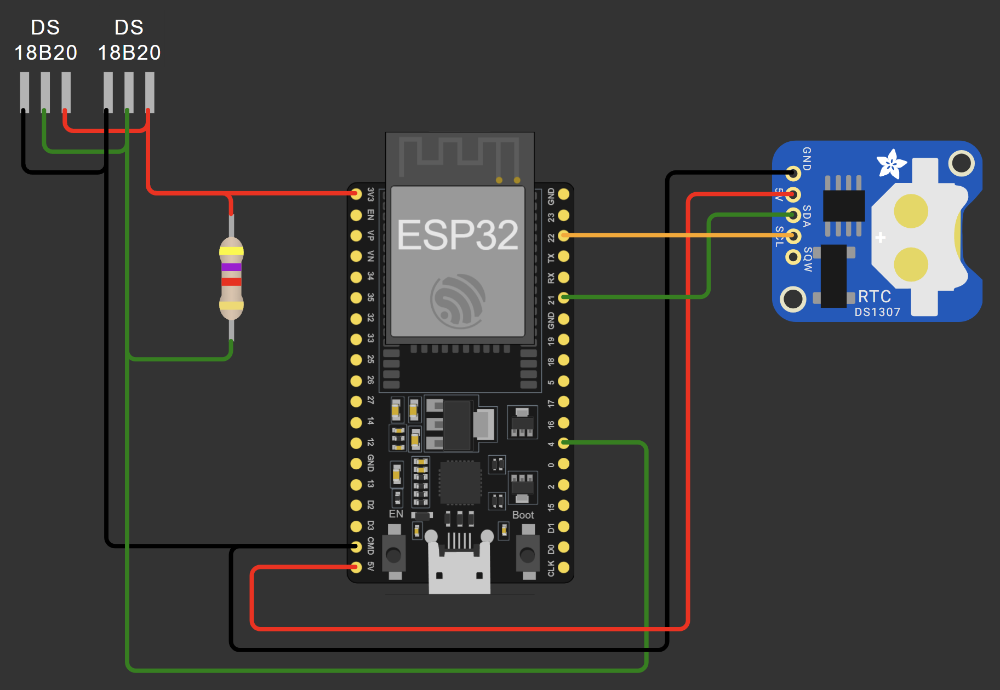

# BodyTempMonitor

Мониторинг температуры тела с использованием двух датчиков DS18B20. Устройство периодически считывает температуру, сохраняет данные в CSV-файл на LittleFS и отправляет их на HTTP-сервер по Wi-Fi.



## Особенности

- Измерение температуры двумя независимыми датчиками DS18B20.
- Периодическая запись показаний в CSV-файл (`/temper.csv`) на LittleFS.
- Отправка данных на HTTP-сервер (POST JSON) при наличии Wi-Fi.
- Поддержка модуля реального времени DS3231 для абсолютных меток времени.
- Синхронизация времени по NTP при подключении к Wi-Fi.
- Встроенный светодиод (пин 2) сигнализирует о статусе отправки на сервер.
- Serial-команды для работы с журналом:
  - `download` — вывести содержимое CSV в Serial Monitor.
  - `clear` — очистить CSV и пересоздать с заголовком.

## Аппаратное обеспечение

- Микроконтроллер: ESP32 (поддержка LittleFS, Wi-Fi).
- Датчики: 2 × DS18B20 (шина OneWire, пин 4).
- Резистор 4.7 кОм для подтяжки шины OneWire.
- Обязательно: модуль RTC DS3231 для абсолютных меток времени.
- Опционально: модуль DS3231 с батарейкой для сохранения времени при отключении.

## Схема подключения

| Компонент      | Пин ESP32 | Примечание                        |
|----------------|-----------|-----------------------------------|
| DS18B20 (DATA) | 4         | Подтяжка к 3.3В резистором 4.7кОм |
| STATUS LED     | 2         | Встроенный светодиод ESP32        |
| DS3231 (SDA)   | 21        | I2C шина                           |
| DS3231 (SCL)   | 22        | I2C шина                           |

## Установка и настройка

### Требования

- **Arduino IDE** или **PlatformIO**.
- Библиотеки (менеджер библиотек):
  - **OneWire** (Paul Stoffregen)
  - **DallasTemperature** (Miles Burton)
  - **RTClib** (Adafruit)

### Сборка и загрузка

1. Клонируйте репозиторий:
   ```bash
   git clone https://github.com/Cyberfrosch/BodyTempMonitor.git
   ```
2. Откройте `sketch.ino` в Arduino IDE.
3. В `sketch/credential.hpp` укажите свои `WIFI_SSID`, `WIFI_PASS` и `SERVER_URL`.
4. Выберите плату **ESP32** и порт, нажмите **Загрузить**.

### Структура проекта

- `sketch.ino` — главный файл, `setup()` и `loop()`.
- `temperature_monitor.hpp` — константы, структура `SensorReading`, прототипы функций.
- `temperature_monitor.cpp` — реализация: чтение датчиков, LittleFS, Wi-Fi, HTTP, Serial-команды.
- `sketch/credential.hpp` — учетные данные Wi-Fi и URL сервера (не включён в git).

### Конфигурация

Все параметры в `temperature_monitor.hpp`:

#### Аппаратные выводы
- `TEMP_SENSOR_PIN` — пин OneWire (по умолчанию 4).
- `STATUS_LED` — пин светодиода (по умолчанию 2).

#### Хранилище
- `CSV_PATH` — путь к файлу журнала (по умолчанию `/temper.csv`).
- `SAVE_INTERVAL_MS` — интервал записи в мс (по умолчанию 10 сек).

#### HTTP
- `HTTP_TIMEOUT_MS` — таймаут HTTP-запроса (по умолчанию 5000 мс).
- `HTTP_RETRY_DELAY_MS` — задержка перед повторной попыткой (по умолчанию 1000 мс).

#### Wi-Fi
- `WIFI_CONNECT_ATTEMPTS` — максимум попыток подключения (по умолчанию 20).
- `WIFI_RETRY_DELAY_MS` — задержка между попытками (по умолчанию 500 мс).

#### NTP
- `NTP_SERVER` — адрес NTP сервера (по умолчанию `pool.ntp.org`).
- `GMT_OFFSET_SEC` — смещение часового пояса (по умолчанию 7*3600 для UTC+7).
- `DAYLIGHT_OFFSET_SEC` — смещение летнего времени (по умолчанию 0).

#### Датчики
- `MIN_SENSORS_REQUIRED` — минимум датчиков (по умолчанию 2).
- `DEVICE_ADDR_SIZE` — размер адреса OneWire (по умолчанию 8 байт).

#### Учетные данные (из `credential.hpp`)
- `WIFI_SSID` — имя Wi-Fi сети.
- `WIFI_PASS` — пароль Wi-Fi.
- `SERVER_URL` — адрес HTTP-сервера для POST.

## Использование

После загрузки прошивки:

1. В Serial Monitor (115200) появится статус инициализации RTC, LittleFS и Wi-Fi.
2. Каждые `SAVE_INTERVAL_MS` секунд в CSV записывается строка `unixtime,temp0,temp1`.
3. При наличии Wi-Fi данные отправляются POST-запросом на `SERVER_URL` с Unix timestamp.
4. Встроенный светодиод горит при успешной отправке, мигает при ошибке.

### Serial-команды

Введите команду в Serial Monitor и нажмите Enter:

| Команда    | Действие                              |
|------------|---------------------------------------|
| `download` | Вывести содержимое CSV в Serial       |
| `clear`    | Очистить CSV, пересоздать с заголовком |
| `rebind`   | Сбросить привязку датчиков (требуется перезагрузка) |

### Формат CSV

```
reltime,temp0,temp1
1735123456,36.60,37.20
1735123516,36.65,37.15
```

- `unixtime` — Unix timestamp от RTC (абсолютное время).
- При отсутствии RTC используется `millis() / 1000` (относительное время).

## Серверная часть (ПК)

### Зависимости

```bash
pip install flask pyserial
```

### server.py — приём данных по Wi-Fi

Flask-сервер принимает POST-запросы с ESP32 и сохраняет данные в `sensor_data.db`.

```bash
python server/server.py
```

- `POST /api/data` — принимает JSON `{"temp0": float, "temp1": float, "timestamp": int}`.
- `GET /dashboard` — веб-дашборд с графиком и заметками.
- `GET /api/chart-data` — JSON-данные для графика.
- `POST /api/notes` — добавление заметки.

Адрес сервера укажите в `sketch/credential.hpp` в поле `SERVER_URL`.

### logger.py — загрузка CSV через Serial

Если Wi-Fi недоступен, данные можно выгрузить напрямую с ESP32 через USB.

**Режим загрузки CSV:**
```bash
python server/logger.py
```

1. Скрипт отправляет команду `download` в Serial Monitor.
2. Считывает CSV между маркерами `--- BEGIN FILE ---` и `--- END FILE ---`.
3. Проверяет валидность значений (исключает -127 и значения вне диапазона).
4. Пропускает дубликаты, уже записанные сервером.
5. Сохраняет результат в `sensor_data.db`.

**Режим мониторинга в реальном времени:**
```bash
python server/logger.py --monitor
```

Отслеживает вывод Serial в реальном времени и автоматически сохраняет данные в БД при обнаружении строки `Logged: ...`. Остановка — Ctrl+C.

**Очистка CSV на ESP32:**
```bash
python server/logger.py --clear
```

Настройки в начале файла:

| Параметр      | Описание                          |
|---------------|-----------------------------------|
| `SERIAL_PORT` | COM-порт ESP32 (например, `COM5`) |
| `BAUD_RATE`   | Скорость (по умолчанию 115200)    |
| `DATABASE`    | Путь к SQLite-файлу               |

### config_tool.py — управление конфигурацией ESP32

Утилита читает и записывает параметры NVS-хранилища устройства через Serial.

**Показать текущую конфигурацию:**
```bash
python server/config_tool.py --show
```

**Установить один параметр:**
```bash
python server/config_tool.py --set wifi_ssid=MyNetwork
```

**Загрузить конфигурацию из `server/config.json` или по явномму пути:**
```bash
python server/config_tool.py --upload
python server/config_tool.py --upload --file /path/to/config
```

**Сброс к значениям по умолчанию:**
```bash
python server/config_tool.py --reset
```

**Интерактивный режим:**
```bash
python server/config_tool.py --interactive
```

#### config.json — файл конфигурации

Файл `server/config.json` содержит параметры, которые будут загружены на устройство командой `--upload`. Поддерживаемые ключи:

| Ключ            | Описание                                          |
|-----------------|---------------------------------------------------|
| `wifi_ssid`     | Имя Wi-Fi сети                                    |
| `wifi_pass`     | Пароль Wi-Fi (при выводе маскируется как `***`)   |
| `server_url`    | URL HTTP-сервера для POST-запросов                |
| `ntp_server`    | Адрес NTP-сервера (например, `pool.ntp.org`)      |
| `gmt_offset`    | Смещение часового пояса в секундах (UTC+7 = 25200)|
| `daylight`      | Смещение летнего времени в секундах               |
| `save_interval` | Интервал записи в CSV, мс                         |
| `http_timeout`  | Таймаут HTTP-запроса, мс                          |
| `http_delay`    | Задержка перед повторной HTTP-попыткой, мс        |
| `wifi_attempts` | Максимум попыток подключения к Wi-Fi              |

Ключи, отсутствующие в файле, пропускаются. Неизвестные ключи вызывают предупреждение и также пропускаются.

Настройки в начале файла:

| Параметр      | Описание                          |
|---------------|-----------------------------------|
| `SERIAL_PORT` | COM-порт ESP32 (например, `COM5`) |
| `BAUD_RATE`   | Скорость (по умолчанию 115200)    |

### Структура БД

Оба скрипта используют одинаковую схему таблицы `temperatures`:

| Поле          | Тип     | Описание                  |
|---------------|---------|---------------------------|
| `id`          | INTEGER | Первичный ключ            |
| `timestamp`   | TEXT    | Дата и время записи       |
| `sensor_id`   | INTEGER | 0 — первый датчик, 1 — второй |
| `temperature` | REAL    | Температура в °C          |

### Валидация данных

- Значения `-127` (ошибка датчика DS18B20) игнорируются.
- Температуры вне диапазона -50°C..+100°C игнорируются.
- Дубликаты (одинаковые timestamp + sensor_id) не вставляются.

## Сборка и развёртывание бинарей

> **Важно:** PyInstaller не поддерживает кросс-компиляцию. Бинарь для Windows нужно
> собирать на Windows, для Linux — на Linux.

### Состав поставки

После сборки в `dist/` окажутся:

| Файл            | Назначение                                      |
|-----------------|-------------------------------------------------|
| `server(.exe)`  | HTTP-сервер                                     |
| `tool(.exe)`    | CLI-утилита: `config` + `log`                   |
| `config.json`   | Файл конфигурации — отредактируйте перед использованием |

`sensor_data.db` создаётся автоматически в той же папке, что и запущенный бинарь.
Оба бинаря при запуске из одной директории используют **одну и ту же** БД.

### Сборка на Windows

```powershell
.\build.ps1
```

### Сборка на Linux

```bash
bash build.sh
```

Скрипты создают venv, устанавливают зависимости из `requirements.txt` и
`requirements-build.txt` (включая `pyinstaller`), затем запускают оба spec-файла.

### Запуск бинарей

```
dist\server.exe                        # запуск HTTP-сервера (Windows)
dist\tool.exe config --show            # показать конфигурацию ESP32
dist\tool.exe config --upload          # загрузить config.json на устройство
dist\tool.exe log                      # выгрузить CSV-журнал в БД
dist\tool.exe log --monitor            # мониторинг Serial в реальном времени
```

```bash
dist/server                            # запуск HTTP-сервера (Linux)
dist/tool config --show
dist/tool log --monitor
```

Прямые запуски Python-скриптов по-прежнему работают:

```bash
python server/server.py
python server/config_tool.py --show
python server/logger.py --monitor
python server/tool.py config --show
python server/tool.py log
```

---

**Примечание:** Устройство предназначено только для образовательных и исследовательских целей. Не используйте его для реального медицинского мониторинга без соответствующей сертификации.
